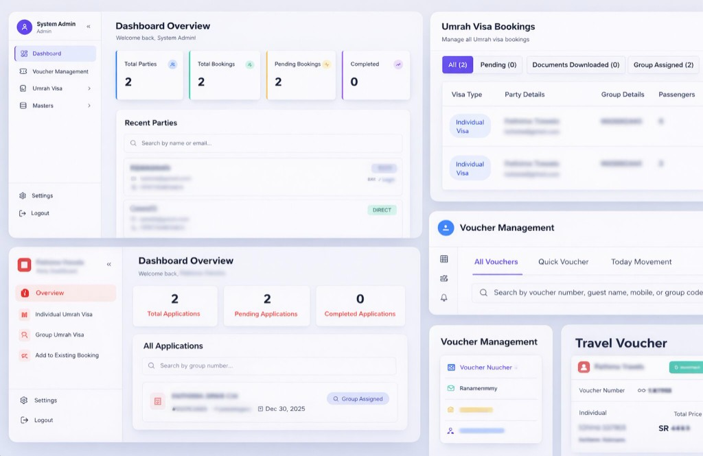

# Moulavi ERP

Operations platform for **Umrah visa booking** — party (client) management, multi-step individual and group bookings, staff workflow, travel vouchers, billing, and email/WhatsApp notifications.

<p align="center">
  
</p>

<p align="center">
  <em>Admin dashboard, visa status queues, voucher management, and travel voucher detail</em>
</p>

---

## Overview

Moulavi ERP is a purpose-built system for travel agencies handling Umrah visas. Staff manage parties and booking pipelines; parties (B2B or direct) can sign in and submit applications. Bookings move through a documented status workflow from document intake through group assignment, voucher generation, and billing.

| Area | Capabilities |
|------|----------------|
| **Parties** | B2B / Direct clients, multi-currency (SAR, INR, AED), optional login, document KYC |
| **Umrah visas** | Individual & group flows, passenger docs (ZIP), hotel or iqama, optional transport |
| **Workflow** | Status-driven ops: pending → documents → group → voucher → bill → success |
| **Vouchers & bills** | Movement/hotel/flight vouchers, PDF generation, pricing in SAR |
| **Comms** | Email (SMTP) and WhatsApp for credentials, confirmations, and ops updates |
| **Masters** | Locations, transport, routes, pricing, currencies, visa windows |

**Live demo:** [moulavierp.vercel.app](https://moulavierp.vercel.app)

---

## Tech stack

| Layer | Stack |
|-------|--------|
| **Frontend** | Next.js 14 (App Router), TypeScript, Tailwind CSS, shadcn/ui, React Hook Form + Zod, Axios |
| **Backend** | Express.js, TypeScript, Zod / express-validator |
| **Data** | PostgreSQL, Prisma ORM |
| **Auth** | JWT access + refresh tokens, bcrypt, role-based access (`admin` / `staff` / `party`) |
| **Files** | Multer → local disk or AWS S3 / DigitalOcean Spaces |
| **Integrations** | Nodemailer, WhatsApp (smsidea), Google Sheets (passenger / Nusuk sync), Puppeteer & jsPDF |

---

## Repository layout

```
moulavi-erp/
├── backend/                 # Express API, Prisma schema & migrations
│   ├── prisma/
│   ├── src/
│   │   ├── routes/          # REST API (auth, parties, umrah-visa, vouchers, …)
│   │   ├── services/        # Email, WhatsApp, PDF, status sync, cancellation
│   │   ├── middleware/
│   │   └── config/
│   └── scripts/             # Admin create, master data seeds
├── frontend/                # Next.js app (admin, staff, party portals)
│   ├── app/
│   ├── components/
│   └── lib/
├── docs/images/             # Screenshots and assets
└── package.json             # Root scripts (dev both apps, migrate, build)
```

---

## Getting started

### Prerequisites

- Node.js 18+
- PostgreSQL 14+
- npm

### Quick start

```bash
# Install dependencies (backend + frontend)
npm run install:all

# Backend: configure env, then migrate & run
cd backend
# Create .env with DATABASE_URL, JWT secrets, SMTP, etc. (see SETUP_GUIDE.md)
npx prisma migrate deploy
npx prisma generate
npm run create-admin   # optional: seed admin user
npm run seed-master    # optional: master data
npm run dev            # http://localhost:5000

# Frontend (new terminal)
cd frontend
# Create .env.local with NEXT_PUBLIC_API_URL=http://localhost:5000/api
npm run dev            # http://localhost:3000
```

Or from the repo root (after both env files exist):

```bash
npm run dev            # runs backend + frontend via concurrently
```

For a full walkthrough (database, env vars, email, WhatsApp), see **[SETUP_GUIDE.md](./SETUP_GUIDE.md)**.

### Default admin

After creating an admin user (via `npm run create-admin` or your seed process), use those credentials to sign in at `/auth`.

Change default passwords before any production use.

---

## Roles & access

| Role | Access |
|------|--------|
| **Admin / Staff** | Parties, Umrah visa queue, vouchers, masters, workflow actions |
| **Party** | Own bookings, individual/group visa submission, add to existing booking |

Authentication uses JWT; the frontend refreshes tokens via `/api/auth/refresh`. Party users are scoped to their own `partyId`.

---

## Booking workflow (summary)

Statuses: `pending` → `documents_downloaded` → `group_assigned` → `voucher` → `bill` → `booking_success` (plus `cancelled`).

Initial status and allowed actions depend on group number, accommodation type (hotel vs iqama), and whether transport is required. Full matrix: **[UMRAH_VISA_BOOKING_FLOW.md](./UMRAH_VISA_BOOKING_FLOW.md)**.

---

## Documentation

| Document | Topic |
|----------|--------|
| [SETUP_GUIDE.md](./SETUP_GUIDE.md) | End-to-end local setup |
| [UMRAH_VISA_BOOKING_FLOW.md](./UMRAH_VISA_BOOKING_FLOW.md) | Status machine & ops steps |
| [S3_FILE_STORAGE_EXPLANATION.md](./S3_FILE_STORAGE_EXPLANATION.md) | Local vs S3 / Spaces uploads |
| [PRODUCTION_EMAIL_WHATSAPP_SETUP.md](./PRODUCTION_EMAIL_WHATSAPP_SETUP.md) | Production email & WhatsApp |
| [CONTRIBUTING.md](./CONTRIBUTING.md) | Contribution guidelines |

---

## Scripts

| Command | Description |
|---------|-------------|
| `npm run install:all` | Install backend and frontend deps |
| `npm run dev` | Run API + Next.js together |
| `npm run build` | Build frontend for production |
| `npm run migrate` | Run backend migrate script |

Backend-only: `npm run create-admin`, `npm run seed-master`, `npx prisma migrate deploy`.

---

## Deployment

- **Frontend:** Vercel (or similar); set `NEXT_PUBLIC_API_URL` to the production API.
- **Backend:** Node host (e.g. Render) with managed PostgreSQL; configure JWT, SMTP, WhatsApp, and optional S3.
- Use strong secrets, HTTPS, and restricted CORS origins in production.

---

## License

Proprietary software for the Moulavi ERP system. All rights reserved unless otherwise stated in repository license terms.
